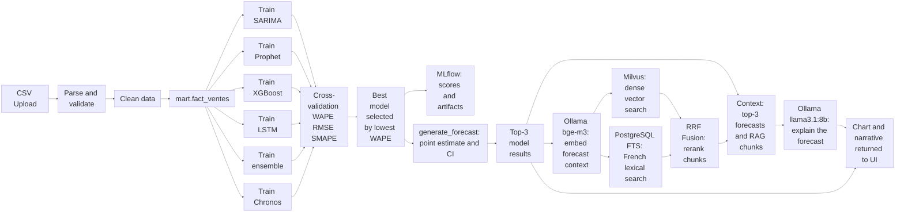

## UC1 — Sales Forecasting and Result Explanation

```mermaid
%%{init: {"theme": "default", "themeVariables": {"fontSize": "40px"}}}%%
flowchart LR
    A["CSV Upload"] --> B["Parse and validate"]
    B --> C["Clean data"]
    C --> D["mart.fact_ventes"]
    D --> E["Train SARIMA"]
    D --> F["Train Prophet"]
    D --> G["Train XGBoost"]
    D --> H["Train LSTM"]
    D --> I["Train ensemble"]
    D --> J["Train Chronos"]
    E --> K["Cross-validation WAPE RMSE SMAPE"]
    F --> K
    G --> K
    H --> K
    I --> K
    J --> K
    K --> L["Best model selected by lowest WAPE"]
    L --> M["MLflow: scores and artifacts"]
    L --> N["generate_forecast: point estimate and CI"]
    N --> O["Top-3 model results"]
    O --> P["Ollama bge-m3: embed forecast context"]
    P --> Q["Milvus: dense vector search"]
    P --> R["PostgreSQL FTS: French lexical search"]
    Q --> S["RRF Fusion: rerank chunks"]
    R --> S
    O --> T["Context: top-3 forecasts and RAG chunks"]
    S --> T
    T --> U["Ollama llama3.1:8b: explain the forecast"]
    U --> V["Chart and narrative returned to UI"]
    O --> V
```
