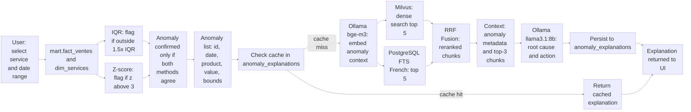

## UC2 — Anomaly Detection and Explanation

```mermaid
%%{init: {"theme": "default", "themeVariables": {"fontSize": "40px"}}}%%
flowchart LR
    A["User: select service and date range"] --> B["mart.fact_ventes and dim_services"]
    B --> C["IQR: flag if outside 1.5x IQR"]
    B --> D["Z-score: flag if z above 3"]
    C --> E["Anomaly confirmed only if both methods agree"]
    D --> E
    E --> F["Anomaly list: id, date, product, value, bounds"]
    F --> G["Check cache in anomaly_explanations"]
    G -->|"cache hit"| H["Return cached explanation"]
    G -->|"cache miss"| I["Ollama bge-m3: embed anomaly context"]
    I --> J["Milvus: dense search top 5"]
    I --> K["PostgreSQL FTS French: top 5"]
    J --> L["RRF Fusion: reranked chunks"]
    K --> L
    L --> M["Context: anomaly metadata and top-3 chunks"]
    M --> N["Ollama llama3.1:8b: root cause and action"]
    N --> O["Persist to anomaly_explanations"]
    O --> P["Explanation returned to UI"]
    H --> P
```
