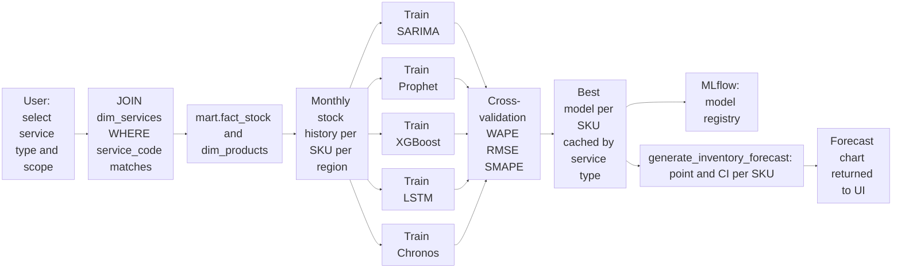

## UC3 — Stock and Inventory Forecasting

```mermaid
%%{init: {"theme": "default", "themeVariables": {"fontSize": "40px"}}}%%
flowchart LR
    A["User: select service type and scope"] --> B["JOIN dim_services WHERE service_code matches"]
    B --> C["mart.fact_stock and dim_products"]
    C --> D["Monthly stock history per SKU per region"]
    D --> E["Train SARIMA"]
    D --> F["Train Prophet"]
    D --> G["Train XGBoost"]
    D --> H["Train LSTM"]
    D --> I["Train Chronos"]
    E --> J["Cross-validation WAPE RMSE SMAPE"]
    F --> J
    G --> J
    H --> J
    I --> J
    J --> K["Best model per SKU cached by service type"]
    K --> L["MLflow: model registry"]
    K --> M["generate_inventory_forecast: point and CI per SKU"]
    M --> N["Forecast chart returned to UI"]
```
