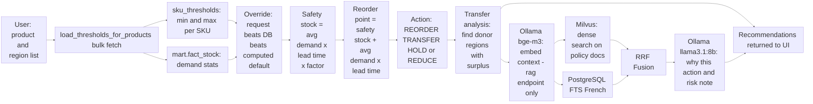

## UC4 — Stock Recommendations

```mermaid
%%{init: {"theme": "default", "themeVariables": {"fontSize": "40px"}}}%%
flowchart LR
    A["User: product and region list"] --> B["load_thresholds_for_products bulk fetch"]
    B --> C["sku_thresholds: min and max per SKU"]
    B --> D["mart.fact_stock: demand stats"]
    C --> E["Override: request beats DB beats computed default"]
    D --> E
    E --> F["Safety stock = avg demand x lead time x factor"]
    F --> G["Reorder point = safety stock + avg demand x lead time"]
    G --> H["Action: REORDER TRANSFER HOLD or REDUCE"]
    H --> I["Transfer analysis: find donor regions with surplus"]
    I --> R["Recommendations returned to UI"]
    I --> J["Ollama bge-m3: embed context - rag endpoint only"]
    J --> K["Milvus: dense search on policy docs"]
    J --> L["PostgreSQL FTS French"]
    K --> M["RRF Fusion"]
    L --> M
    M --> N["Ollama llama3.1:8b: why this action and risk note"]
    N --> R
```
