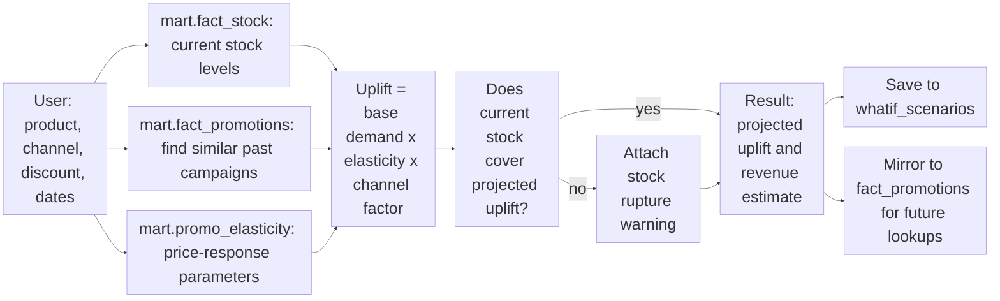

## UC5 — Promo What-If Simulation

```mermaid
%%{init: {"theme": "default", "themeVariables": {"fontSize": "40px"}}}%%
flowchart LR
    A["User: product, channel, discount, dates"] --> B["mart.fact_stock: current stock levels"]
    A --> C["mart.fact_promotions: find similar past campaigns"]
    A --> D["mart.promo_elasticity: price-response parameters"]
    B --> E["Uplift = base demand x elasticity x channel factor"]
    C --> E
    D --> E
    E --> F["Does current stock cover projected uplift?"]
    F -->|"yes"| G["Result: projected uplift and revenue estimate"]
    F -->|"no"| H["Attach stock rupture warning"]
    H --> G
    G --> I["Save to whatif_scenarios"]
    G --> J["Mirror to fact_promotions for future lookups"]
```
