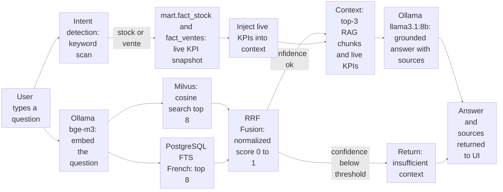

## UC6 — Forecast Q and A Chatbot

```mermaid
%%{init: {"theme": "default", "themeVariables": {"fontSize": "40px"}}}%%
flowchart LR
    A["User types a question"] --> B["Intent detection: keyword scan"]
    B -->|"stock or vente"| C["mart.fact_stock and fact_ventes: live KPI snapshot"]
    C --> D["Inject live KPIs into context"]
    A --> E["Ollama bge-m3: embed the question"]
    E --> F["Milvus: cosine search top 8"]
    E --> G["PostgreSQL FTS French: top 8"]
    F --> H["RRF Fusion: normalized score 0 to 1"]
    G --> H
    H -->|"confidence below threshold"| I["Return: insufficient context"]
    H -->|"confidence ok"| J["Context: top-3 RAG chunks and live KPIs"]
    D --> J
    J --> K["Ollama llama3.1:8b: grounded answer with sources"]
    K --> L["Answer and sources returned to UI"]
    I --> L
```
