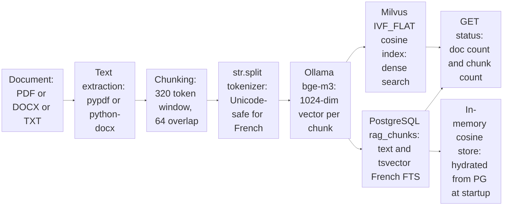

## UC7 — Knowledge Base Management

```mermaid
%%{init: {"theme": "default", "themeVariables": {"fontSize": "40px"}}}%%
flowchart LR
    A["Document: PDF or DOCX or TXT"] --> B["Text extraction: pypdf or python-docx"]
    B --> C["Chunking: 320 token window, 64 overlap"]
    C --> D["str.split tokenizer: Unicode-safe for French"]
    D --> E["Ollama bge-m3: 1024-dim vector per chunk"]
    E --> F["Milvus IVF_FLAT cosine index: dense search"]
    E --> G["PostgreSQL rag_chunks: text and tsvector French FTS"]
    G --> H["In-memory cosine store: hydrated from PG at startup"]
    F --> I["GET status: doc count and chunk count"]
    G --> I
```
