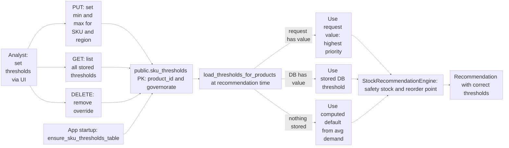

## UC8 — Per-SKU Threshold Management

```mermaid
%%{init: {"theme": "default", "themeVariables": {"fontSize": "40px"}}}%%
flowchart LR
    A["Analyst: set thresholds via UI"] --> B["PUT: set min and max for SKU and region"]
    A --> C["GET: list all stored thresholds"]
    A --> D["DELETE: remove override"]
    B --> E["public.sku_thresholds PK: product_id and governorate"]
    C --> E
    D --> E
    F["App startup: ensure_sku_thresholds_table"] --> E
    E --> G["load_thresholds_for_products at recommendation time"]
    G -->|"request has value"| H["Use request value: highest priority"]
    G -->|"DB has value"| I["Use stored DB threshold"]
    G -->|"nothing stored"| J["Use computed default from avg demand"]
    H --> K["StockRecommendationEngine: safety stock and reorder point"]
    I --> K
    J --> K
    K --> L["Recommendation with correct thresholds"]
```
