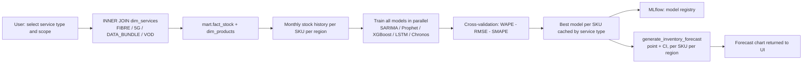
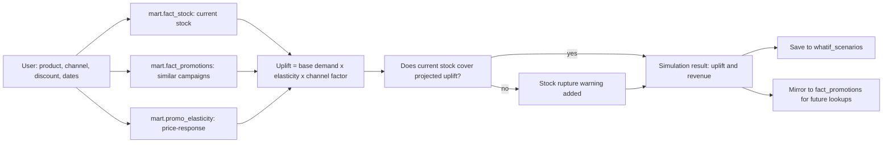
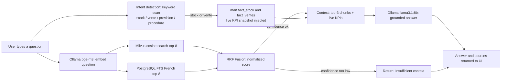
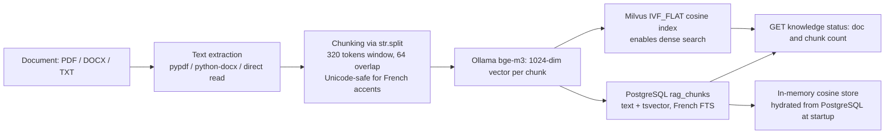
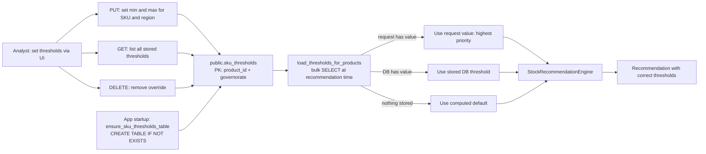

# Fibre Forecast System — Technical Diagrams

---

## UC1 — Sales Forecasting and Result Explanation

```mermaid
flowchart LR
    A["CSV Upload"] --> B["Parse and validate"]
    B --> C["Clean: duplicates, nulls, outliers"]
    C --> D["mart.fact_ventes"]
    D --> E["Train all models in parallel<br/>SARIMA / Prophet / XGBoost / LSTM<br/>LinearRegression / ensemble / Chronos"]
    E --> F["Cross-validation<br/>WAPE - RMSE - SMAPE"]
    F --> G["Best model selected"]
    G --> H["MLflow: scores and artifacts"]
    G --> I["generate_forecast<br/>point estimate + CI, 1-24 months"]
    I --> J["Top-3 model results"]
    J --> K["Ollama bge-m3: embed context"]
    K --> L["Milvus dense search"]
    K --> M["PostgreSQL FTS French"]
    L --> N["RRF Fusion"]
    M --> N
    N --> O["Context: top-3 forecasts + RAG chunks"]
    J --> O
    O --> P["Ollama llama3.1:8b<br/>Why these values? Which drivers?"]
    P --> Q["Chart and Narrative returned to UI"]
    J --> Q
```

---

## UC2 — Anomaly Detection and Explanation

```mermaid
flowchart LR
    A["User: select service and dates"] --> B["mart.fact_ventes + dim_services"]
    B --> C["IQR method: flag if outside 1.5x IQR"]
    B --> D["Z-score: flag if z greater than 3"]
    C --> E["Anomaly confirmed if BOTH agree"]
    D --> E
    E --> F["Anomaly list: id, date, product, value"]
    F --> G["Check cache: anomaly_explanations"]
    G -->|"HIT"| H["Return cached explanation"]
    G -->|"MISS"| I["Ollama bge-m3: embed anomaly context"]
    I --> J["Milvus dense search top-5"]
    I --> K["PostgreSQL FTS French top-5"]
    J --> L["RRF Fusion"]
    K --> L
    L --> M["Context: metadata + RAG chunks + baseline"]
    M --> N["Ollama llama3.1:8b<br/>Root cause, factors, action"]
    N --> O["Persist to anomaly_explanations"]
    O --> P["Explanation returned to UI"]
    H --> P
```

---

## UC3 — Stock and Inventory Forecasting

---

## UC4 — Stock Recommendations

```mermaid
flowchart LR
    A["User: product and region list"] --> B["load_thresholds_for_products<br/>bulk fetch from sku_thresholds"]
    B --> C["sku_thresholds: min and max per SKU"]
    B --> D["mart.fact_stock: demand stats"]
    C --> E["Override logic<br/>request value beats DB beats computed"]
    D --> E
    E --> F["Safety stock = avg demand x lead time x factor"]
    F --> G["Reorder point = safety stock + avg demand x lead time"]
    G --> H["Action: REORDER / TRANSFER / HOLD / REDUCE"]
    H --> I["Transfer analysis: find donor regions"]
    I --> R["Recommendations returned to UI"]
    I --> J["Ollama bge-m3: embed context<br/>only on rag endpoint"]
    J --> K["Milvus dense search"]
    J --> L["PostgreSQL FTS French"]
    K --> M["RRF Fusion"]
    L --> M
    M --> N["Ollama llama3.1:8b: Why this action?"]
    N --> R
```

---

## UC5 — Promo What-If Simulation

---

## UC6 — Forecast Q and A Chatbot

---

## UC7 — Knowledge Base Management

---

## UC8 — Per-SKU Threshold Management

